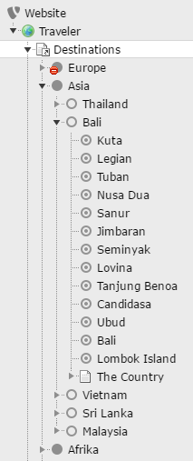

# Netresearch Pagetree

Provides extended functionality for the pagetree, such as showing non page records (plain or hierarchical) and wiring them to custom pages.

## Configuration

The extension is completely configured via Page TsConfig - see the following example:

With this TsConfig at the page "Destinations"...

```
options.pageTree.showTables {
    tx_traveler_domain_model_destination {
    	where = type=1
    	relations = children,editorial_pages
    }
    pages {
    	relations = children
    }
}
```

and the according tables and relations, you'll get a pagetree like that:


